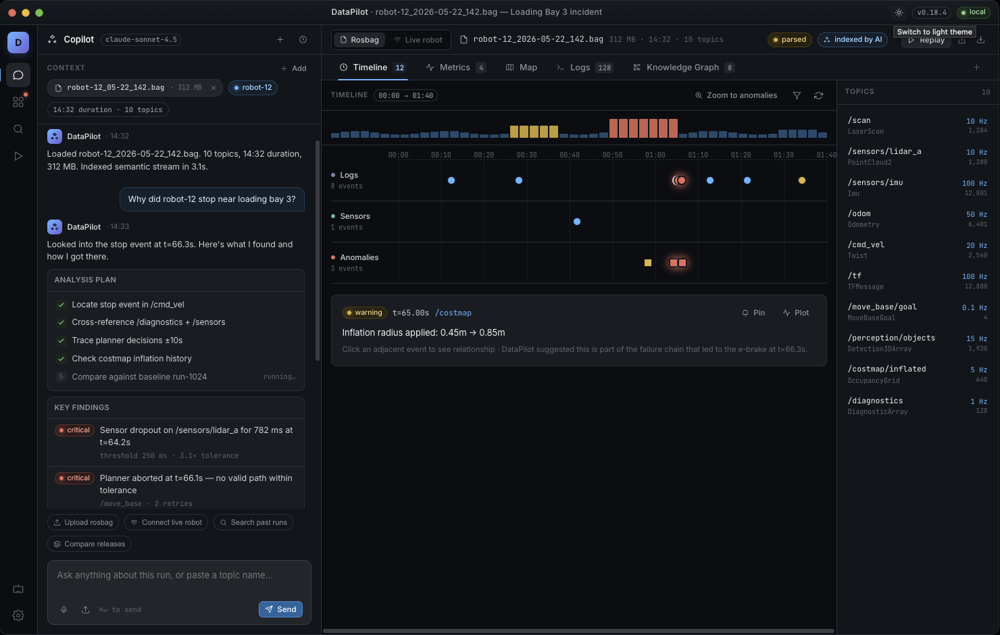

<h1 align="center">DataPilot</h1>

<p align="center">
  <strong>AI-powered copilot that helps robotics engineers debug ROS robots instantly.</strong>
</p>

<p align="center">
  <picture>
    <source media="(prefers-color-scheme: dark)" srcset="mock_design/datapilot_ui_mockup_dark.png">
    <source media="(prefers-color-scheme: light)" srcset="mock_design/datapilot_ui_mockup_light.png">
    
  </picture>
</p>

<p align="center">
  <a href="https://www.electronjs.org/"></a>
  <a href="https://fastapi.tiangolo.com/"></a>
  <a href="https://neo4j.com/"></a>
  <a href="https://www.docker.com/"></a>
  <a href="https://www.langchain.com/langgraph"></a>
</p>

---

## 📌 Problem & Solution

### The Problem
Robotics software debugging is painfully slow. When a robot behaves unexpectedly or crashes, engineers are forced to download massive binary telemetry logs (rosbags), launch manual visualizers, and dig through millions of lines of unstructured logs on terminal topics. This manual process takes hours, causing long development delays and expensive operational downtime for robot fleets.

### The Solution
DataPilot parses and indexes ROS 2 bag files automatically, converting unstructured node telemetry into a structured timeline and a semantic vector database. Engineers simply load a local bag and ask, *"Why did navigation abort?"* or *"Why did the camera node drop frames?"*. The AI diagnostics engine pinpoints the root cause, cites the exact timestamps/nodes, and delivers actionable code parameter modifications in seconds—all running securely on the developer's local machine.

---

## 📂 Project Planning & Architecture Documents

The project preparation is fully documented across these specialized planning artifacts:

* 📄 **[PRD.md](file:///Users/kati/Documents/kati_projects/dataPilot/docs/PRD.md)**: Product Requirements, core user stories, and MoSCoW prioritization.
* 📄 **[ARCHITECTURE.md](file:///Users/kati/Documents/kati_projects/dataPilot/docs/ARCHITECTURE.md)**: High-level layout, database schemas, API specs, and data flow.
* 📄 **[FOLDER_STRUCTURE.md](file:///Users/kati/Documents/kati_projects/dataPilot/docs/FOLDER_STRUCTURE.md)**: Details the exact code layout for frontend, backend, and testing assets.
* 📄 **[TECH_DECISIONS.md](file:///Users/kati/Documents/kati_projects/dataPilot/docs/TECH_DECISIONS.md)**: Why we chose our stack, trade-offs, and how we mitigate risk.
* 📄 **[SPRINT_PLAN.md](file:///Users/kati/Documents/kati_projects/dataPilot/docs/SPRINT_PLAN.md)**: A day-by-day developer sprint timeline to execute the 1-week build.

---

## ⚡ Quick Start

To spin up the DataPilot Electron application locally:

### 1. Prerequisites
Ensure you have the following installed on your system:
* **Node.js** (v20+ recommended) & **pnpm**
* **Docker** & **Docker Desktop** (with local socket sharing enabled)

### 2. Setup & Launching the App
1. Install client dependencies:
   ```bash
   pnpm install
   ```
2. Make sure **Docker Desktop** is running.
3. Start the application in development mode:
   ```bash
   pnpm dev
   ```

DataPilot will automatically monitor your Docker socket, spin up containerized local services (FastAPI backend, Neo4j databases, and decoupled MCP workers), and open the native desktop UI.

### 3. Configure API Keys
Once the desktop application launches, navigate to the **Settings** screen in the UI to configure your API keys (supporting OpenAI, Anthropic, Gemini, etc.).

> [!NOTE]
> The desktop application saves all settings securely (encrypted via Electron's `safeStorage` API using your OS-native keychain) and injects them directly into the containerized backend at runtime.

---