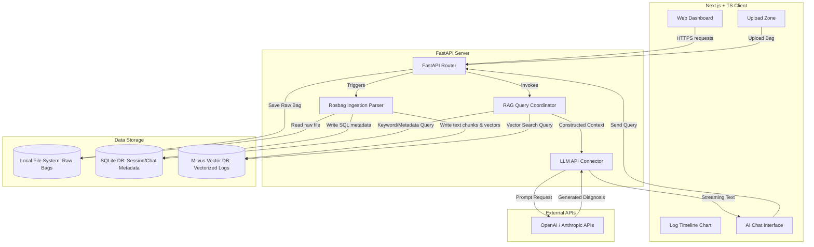
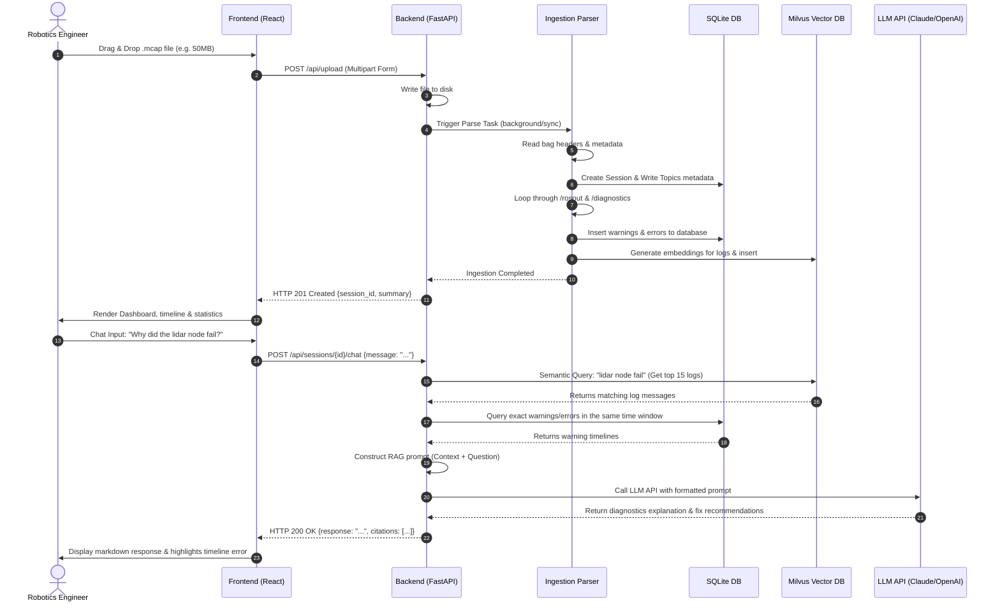

# Architecture Design - DataPilot

This document outlines the system architecture, component breakdown, data flow, database schemas, and API design for DataPilot.

---

## 1. High-Level System Architecture

DataPilot is structured as a decoupled full-stack application. It uses a FastAPI backend to leverage Python's rich ecosystem of robotics and data-science libraries (`mcap`, `sqlite3`, `pandas`) and LLM SDKs, while utilizing a Next.js frontend for a highly responsive, modern debugging interface.



---

## 2. Component Breakdown

### A. Frontend (Next.js + TypeScript)
* **Ingestion Dashboard**: Component that manages drag-and-drop file uploads, progress bars, and basic state management for the active debugging session.
* **Timeline Visualizer**: Renders an interactive, zoomable timeline chart of warnings, errors, and critical messages from the bag, allowing developers to isolate the time window of a crash.
* **RAG Chat Window**: A conversational terminal style UI allowing developers to talk to the AI engine, rendering markdown, citations, and code snippets.
* **Status Monitor**: Displays robot metadata extracted from the bag (e.g., node list, total topics, rate of message publishing).

### B. Backend (FastAPI)
* **API Layer**: Handles routing for file uploads, sessions listing, chat interactions, and telemetry logs retrieval.
* **Rosbag Ingestion Parser**: Custom pipeline that opens ROS 2 `.mcap` or `.db3` bags using Python readers, extracts text records, filters for critical logs (severity > INFO), and structure logs into database records.
* **RAG Engine**: Handles retrieving logs. Rather than standard semantic-only search, it uses a **hybrid search** combining:
  1. *Temporal retrieval*: Gathering logs +/- 10 seconds around error spikes.
  2. *Semantic retrieval*: Vector searches on "lidar error", "tf timeout", "out of bounds".
  3. *Structural search*: Extracting diagnostics by specific node names.
* **LLM Coordinator**: Combines retrieved logs with a structured system prompt detailing ROS patterns (e.g., node lifecycle, navigation costmap behaviors) to build the context for OpenAI/Anthropic APIs.

### C. Storage & Database Layer
* **Raw Filesystem**: Store uploaded rosbags locally on disk.
* **SQLite (SQL DB)**: Keeps track of general metadata like session ID, robot identifier, start/end timestamps, topics present, and chat message history.
* **Milvus (Vector DB)**: Acts as the semantic search index. It provides production-ready vector storage and search, with Milvus Lite serving as an embedded option for local deployments.

---

## 3. Data Flow Diagram

The diagram below shows the end-to-end data lifecycle from the moment a user drops a rosbag file to the chat interaction:



---

## 4. Technology Stack Recommendation

| Layer | Recommended Choice | Justification |
| :--- | :--- | :--- |
| **Frontend Framework** | Next.js (App Router) | Production-ready with Server-Side Rendering (SSR), React Server Components (RSC), and built-in routing. |
| **Styling** | Tailwind CSS | Utility-first classes make building modern, dark-mode terminal interfaces quick and standard. |
| **State & Fetching** | Axios + TanStack Query | Ideal for managing server state, polling parse progress, and caching chat sessions. |
| **Charts** | Recharts / Chart.js | Easy to build interactive timeline charts with click handlers (e.g., clicking a bar highlights the time). |
| **Backend Language** | Python 3.10+ | Necessary for importing ROS bag reader libraries and AI/Vector clients without bridges. |
| **Backend Framework** | FastAPI | Async requests, automatic Swagger docs, Pydantic type safety, fast response latency. |
| **Relational Database**| SQLite | Serverless, zero-config SQL database. Perfect for a 1-week hackathon. |
| **Vector Database** | Milvus (Local/Lite) | Production-grade, highly scalable vector database. Milvus Lite provides embedded execution for local development. |
| **ROS Bag Parser** | `mcap` & `mcap-ros2-support` | Read modern MCAP files directly in Python *without* requiring a local ROS installation. |
| **AI LLM API** | Anthropic Claude 3.5 Sonnet | Best-in-class reasoning for complex coding, system debugging, and handling large code context. |

---

## 5. Database Schema Draft (SQLite)

We will use SQLite to model the metadata and the tabular logs extracted for timeline visualization.

```sql
-- Represents a single uploaded rosbag debugging session
CREATE TABLE sessions (
    id TEXT PRIMARY KEY, -- UUID
    filename TEXT NOT NULL,
    filepath TEXT NOT NULL,
    robot_name TEXT,
    ros_version TEXT, -- "ROS1" or "ROS2"
    duration_seconds REAL,
    start_time TEXT, -- ISO Timestamp
    end_time TEXT, -- ISO Timestamp
    total_messages INTEGER,
    topics_list TEXT, -- JSON array of strings
    created_at TIMESTAMP DEFAULT CURRENT_TIMESTAMP
);

-- Index of parsed warnings and errors for timeline display (Fast database queries)
CREATE TABLE filtered_logs (
    id INTEGER PRIMARY KEY AUTOINCREMENT,
    session_id TEXT NOT NULL,
    timestamp TEXT NOT NULL, -- Relative or ISO
    log_level TEXT NOT NULL, -- WARN, ERROR, FATAL
    node_name TEXT NOT NULL,
    message TEXT NOT NULL,
    topic TEXT NOT NULL,
    FOREIGN KEY (session_id) REFERENCES sessions(id) ON DELETE CASCADE
);

-- Maintains conversational thread history per session
CREATE TABLE chat_messages (
    id INTEGER PRIMARY KEY AUTOINCREMENT,
    session_id TEXT NOT NULL,
    role TEXT NOT NULL, -- 'user' or 'assistant'
    content TEXT NOT NULL,
    citations TEXT, -- JSON array of source log links
    created_at TIMESTAMP DEFAULT CURRENT_TIMESTAMP,
    FOREIGN KEY (session_id) REFERENCES sessions(id) ON DELETE CASCADE
);
```

---

## 6. API Endpoint Design

All API endpoints will be prefixed with `/api`.

### Ingestion endpoints

#### 1. Upload Rosbag
* **Method**: `POST`
* **Path**: `/api/upload`
* **Request**: Multi-part Form Data
  * `file`: Binary file (.mcap or .db3)
* **Response**: `202 Accepted`
  ```json
  {
    "session_id": "8f8981df-83cd-41e9-86f2-1fb49cb45e99",
    "filename": "nav_crash_sample.mcap",
    "status": "processing"
  }
  ```

#### 2. Get Parsing Status
* **Method**: `GET`
* **Path**: `/api/sessions/{session_id}/status`
* **Response**: `200 OK`
  ```json
  {
    "session_id": "8f8981df-83cd-41e9-86f2-1fb49cb45e99",
    "status": "completed", -- "processing", "failed", "completed"
    "progress": 100,
    "error_message": null
  }
  ```

### Session Analysis endpoints

#### 3. Get Session Metadata
* **Method**: `GET`
* **Path**: `/api/sessions/{session_id}`
* **Response**: `200 OK`
  ```json
  {
    "session_id": "8f8981df-83cd-41e9-86f2-1fb49cb45e99",
    "metadata": {
      "filename": "nav_crash_sample.mcap",
      "robot_name": "turtlebot4_03",
      "duration_seconds": 124.5,
      "topics": ["/rosout", "/diagnostics", "/cmd_vel", "/scan"],
      "start_time": "2026-05-24T14:02:10Z"
    }
  }
  ```

#### 4. Get Log Timeline Data
* **Method**: `GET`
* **Path**: `/api/sessions/{session_id}/timeline`
* **Query Parameters**:
  * `level`: (Optional) "WARN" | "ERROR" | "FATAL"
* **Response**: `200 OK` (Grouped by seconds or list of logs)
  ```json
  {
    "timeline": [
      {
        "timestamp_offset": 12.4, -- seconds from start
        "level": "WARN",
        "node": "/lidar_driver_node",
        "message": "Lidar packet timeout, retrying connection."
      },
      {
        "timestamp_offset": 14.8,
        "level": "ERROR",
        "node": "/lidar_driver_node",
        "message": "Lidar hardware communication lost."
      }
    ]
  }
  ```

### Chat Debugging endpoints

#### 5. Chat & Diagnose
* **Method**: `POST`
* **Path**: `/api/sessions/{session_id}/chat`
* **Request**:
  ```json
  {
    "message": "Why did the navigation abort at timestamp 14.8?"
  }
  ```
* **Response**: `200 OK`
  ```json
  {
    "response": "The navigation aborted because the `/lidar_driver_node` crashed due to a hardware communication loss. This caused the dynamic obstacles costmap to receive stale data, triggering a safety abort in the `/controller_server` node.",
    "citations": [
      {
        "timestamp_offset": 14.8,
        "node": "/lidar_driver_node",
        "log_level": "ERROR",
        "message": "Lidar hardware communication lost."
      }
    ]
  }
  ```

---

## 7. Deployment Architecture

For the 1-week hackathon, we prioritize simplicity, portability, and "works on my machine" guarantees for the judges. We will deploy using a single multi-container **Docker Compose** stack.

* **Production Container Structure**:
  * **Frontend**: Next.js application built and served via a Node/Nginx container (ports `80` -> `3000`).
  * **Backend**: FastAPI web app running via Uvicorn (port `8000`), storing files in a bind-mounted docker volume (`./data`).
* **Environment variables** containing LLM API keys (`OPENAI_API_KEY` or `ANTHROPIC_API_KEY`) will be passed via a local `.env` file.
