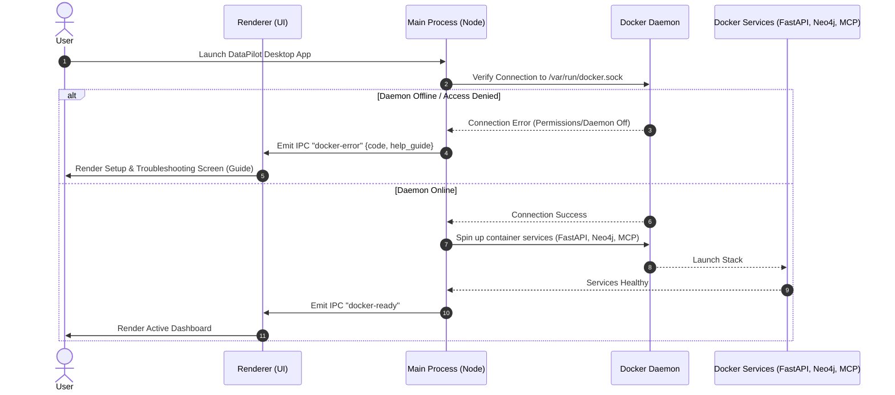
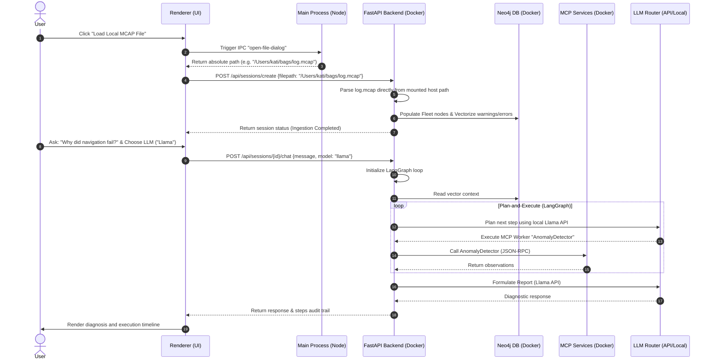

# Architecture Design - DataPilot

This document outlines the system architecture, component breakdown, data flow, database schemas, and API design for DataPilot.

---

## 1. High-Level System Architecture

DataPilot is structured as an **Electron-based desktop application** that runs entirely on the engineer's local machine. This ensures that massive binary robotics telemetry files (rosbags) do not need to be uploaded to cloud systems. 

The Electron application uses a hybrid architecture:
- **Renderer Process (Frontend)**: Runs the HTML/JS/CSS user interface.
- **Main Process (Node.js)**: Runs in the OS environment, communicates with the **Docker socket** (`/var/run/docker.sock`) to orchestrate local backend microservices, and manages native OS functions (e.g., file pickers).
- **Backend Stack (Local Docker Services)**: Spin up dynamically via the Docker socket when Electron starts. This stack includes the **FastAPI Backend (embedding LangGraph)**, a **Neo4j Graph Database** (Fleet Knowledge Graph), and **5 MCP Workers** running as separate containers.
- **LLM Connectivity**: The orchestrator coordinates with either cloud APIs (**OpenAI**, **Gemini**) or a locally hosted **Llama** model.

```mermaid
graph TD
    %% Electron App Shell
    subgraph Electron [Electron Desktop App Shell]
        subgraph Renderer [Renderer Process - UI]
            UI[Web Dashboard]
            Timeline[Log Timeline Chart]
            ChatBox[AI Chat Interface]
            SetupScreen[Setup & Troubleshooting Screen]
        </tbody>
        
        subgraph Main [Main Process - Node.js]
            DockerOrch[Docker Socket Orchestrator]
            IPC[IPC Bridge Handler]
            FilePicker[Native File System Picker]
        end
    end

    %% Host System Docker Socket
    DockerSock[(Docker Host Socket: /var/run/docker.sock)]

    %% Orchestrated Container Services
    subgraph Services [Docker Containers - Launched by Electron]
        API[FastAPI Backend + LangGraph]
        Neo4j[(Neo4j DB: Fleet KG & Vectors)]
        
        subgraph MCPWorkers [MCP Workers]
            RosbagReader[Rosbag Reader Service]
            TrajectoryAnalyzer[Trajectory Analyzer Service]
            PlannerFailureInspector[Planner Failure Inspector Service]
            AnomalyDetector[Anomaly Detector Service]
            ReportComposer[Report Composer Service]
        end
    end

    %% Storage
    subgraph Storage [Host Local Storage]
        FS[(Raw Rosbags / Host File System)]
        SQLite[(SQLite DB: Sessions & Agent Checkpoints)]
    end

    %% LLM Providers
    subgraph LLMProviders [Supported LLM API Providers]
        OpenAI[OpenAI Cloud API]
        Gemini[Google Gemini Cloud API]
        Llama[Local Llama API - e.g. Ollama/Llama.cpp]
    end

    %% Electron Internal Communication
    UI -->|IPC Events| IPC
    IPC -->|Check Docker Daemon| DockerOrch
    IPC -->|Trigger Local Selector| FilePicker
    SetupScreen -->|Poll Setup Verification| DockerOrch

    %% Main Process Orchestrating Docker
    DockerOrch -->|Manage Containers| DockerSock
    DockerSock -->|Run / Monitor| Services

    %% Frontend to Backend API Calls
    UI -.->|Local HTTP Port 8000| API

    %% API Data flows
    API -->|Read/Write State| SQLite
    API -->|Causal & Vector Queries| Neo4j
    API -->|MCP JSON-RPC| MCPWorkers
    MCPWorkers -->|Mount Local Path| FS
    FilePicker -->|Pass Local File Path| API

    %% LLM Routing
    API -->|Cloud Queries| OpenAI
    API -->|Cloud Queries| Gemini
    API -->|Local Queries| Llama
```

---

## 2. Component Breakdown

### A. Electron Client
* **Renderer Process (Frontend)**:
  - Renders the primary workspace dashboards, log timeline charts, and the diagnostic chat terminal using HTML, JavaScript, and Vanilla CSS.
  - Implements a dedicated **Setup & Troubleshooting Screen** that is displayed if the Docker socket check fails (providing clear setup guides for Docker Desktop, daemon settings, and permissions).
  - Handles drag-and-drop actions, mapping file drops directly to host filepaths using native Electron file properties.
* **Main Process (Node.js)**:
  - **Docker Socket Orchestrator**: Connects to the Unix socket `/var/run/docker.sock` (or Windows pipe `//./pipe/docker_engine`). On startup, it checks if Docker is running and pulls/launches the containerized stack (FastAPI, Neo4j, and the 5 MCP servers).
  - **IPC Bridge Handler**: Coordinates secure IPC (Inter-Process Communication) events between the Renderer and Main process.
  - **Native File System Picker**: Opens native OS dialogs to select local `.mcap` files, bypassing browser file upload limits.

### B. Backend Container (FastAPI + LangGraph)
* **API Layer**: Exposes endpoints on local port `8000` to feed dashboard analytics and manage chat sessions.
* **Ingestion Pipeline**: Rather than performing a web upload, the API receives the absolute path of the local file on the host (the directory is shared/mounted into the containers). The parser reads the bag directly from disk, saving metadata to SQLite and seeding Neo4j.
* **LangGraph Orchestrator**: Runs the plan-and-execute state machine. It uses LangGraph's standard SQLite saver to persist run checkpoints locally.
* **LLM Router**: Dispatches reasoning queries based on user settings:
  - **OpenAI**: Connects to cloud API.
  - **Gemini**: Connects to cloud API.
  - **Llama**: Connects to a locally running model instance (e.g., Ollama running on `http://localhost:11434` or Llama.cpp compatibility endpoints).

### C. MCP Workers (Docker Services)
Decoupled services running inside independent Docker containers on the local machine:
1. **RosbagReader**: Extracts topic schemas, diagnostic streams, and TF transformations from raw bags.
2. **TrajectoryAnalyzer**: Computes velocities and plots goal deviations.
3. **PlannerFailureInspector**: Checks navigation path states and costmaps.
4. **AnomalyDetector**: Performs statistical evaluation on high-frequency channels.
5. **ReportComposer**: Creates final summaries.

### D. Storage & Database Layer
* **Host Local Filesystem**: Stores original rosbags and SQLite file database (`db.sqlite`), allowing data persistence across container restarts.
* **Neo4j Container**: Runs inside the local Docker environment, hosting the Fleet Knowledge Graph and storing log embeddings locally.

---

## 3. Data Flow Diagram

### Phase 1: Startup & Docker Verification Flow


### Phase 2: Ingestion & Chat Analysis Flow


---

## 4. Technology Stack Recommendation

| Layer | Recommended Choice | Justification |
| :--- | :--- | :--- |
| **Desktop Shell** | **Electron** | Cross-platform desktop runtime packaging Chromium and Node.js. Enables native OS integration and local execution. |
| **Frontend Framework** | Next.js (Static Export) / React | Rendered inside Electron. Runs locally without remote hosting servers. |
| **Styling** | Vanilla CSS | Custom responsive styles for a premium desktop app shell. |
| **Docker Orchestration** | `dockerode` (Node.js SDK) | Node.js library that accesses `/var/run/docker.sock` to check statuses and start/stop containers. |
| **Backend Framework** | FastAPI (within Docker) | Exposes endpoints to Electron, running containerized to maintain Python version consistency. |
| **Orchestrator** | LangGraph (Python) | Embedded in backend container, manages multi-step agent logic. |
| **Database** | SQLite + Neo4j | SQLite on host handles sessions and checkpointers. Neo4j in Docker stores graphs and vectors. |
| **LLM APIs** | OpenAI, Gemini, Llama | The application routes requests to either cloud API gateways or local ports (e.g. Ollama for Llama execution). |

---

## 5. Database Schema Draft
The SQLite and Neo4j schemas remain consistent with the hybrid structure described in the web architecture, with the following modifications:
1. **SQLite Database location**: The database file `db.sqlite` is saved to the local host's user data directory (e.g., `~/Library/Application Support/datapilot/` on macOS).
2. **Rosbag File paths**: The `sessions` table in SQLite stores the absolute file path on the host instead of a relative upload folder path.

```sql
CREATE TABLE sessions (
    id TEXT PRIMARY KEY, -- UUID
    filename TEXT NOT NULL,
    filepath TEXT NOT NULL, -- Absolute path on the host filesystem
    robot_name TEXT,
    ros_version TEXT,
    duration_seconds REAL,
    start_time TEXT,
    end_time TEXT,
    total_messages INTEGER,
    topics_list TEXT,
    created_at TIMESTAMP DEFAULT CURRENT_TIMESTAMP
);
```

---

## 6. API Endpoint Design

All endpoints are hosted on `http://localhost:8000/api`.

### Session Creation (replacing Upload)

#### 1. Ingest Local File
* **Method**: `POST`
* **Path**: `/api/sessions/create`
* **Request**:
  ```json
  {
    "filepath": "/Users/kati/bags/nav_crash_sample.mcap"
  }
  ```
* **Response**: `202 Accepted`
  ```json
  {
    "session_id": "8f8981df-83cd-41e9-86f2-1fb49cb45e99",
    "filepath": "/Users/kati/bags/nav_crash_sample.mcap",
    "status": "processing"
  }
  ```

### Chat Debugging with LLM Selection

#### 2. Chat & Diagnose
* **Method**: `POST`
* **Path**: `/api/sessions/{session_id}/chat`
* **Request**:
  ```json
  {
    "message": "Why did the navigation abort?",
    "provider": "llama", -- "openai" | "gemini" | "llama"
    "local_endpoint": "http://localhost:11434" -- Optional endpoint for local models
  }
  ```
* **Response**: `200 OK` (Standard structured JSON containing response, audit_trail, and citations).

---

## 7. Setup & Troubleshooting Framework

If the connection to `/var/run/docker.sock` fails, the Electron Renderer process transitions to a dedicated **Setup Panel** providing the following verification guides:

1. **Docker Status Check**: Checks if the Docker Desktop application is launched and running.
2. **Settings Configuration**: Instructs users to enable *"Allow the default Docker socket to be used"* in Docker Desktop settings under Advanced/Security options.
3. **Permission Check**: Displays the shell command to execute if permissions are denied (e.g. `sudo chmod 666 /var/run/docker.sock` on Linux/macOS).
4. **Daemon Verification**: Details how to check daemon status via terminal commands (`docker ps`).
