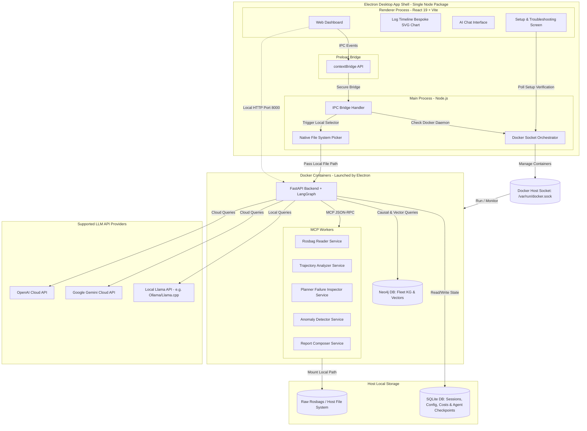
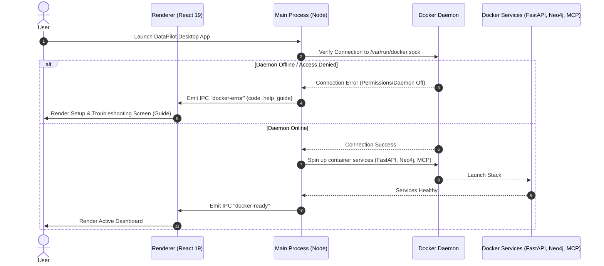
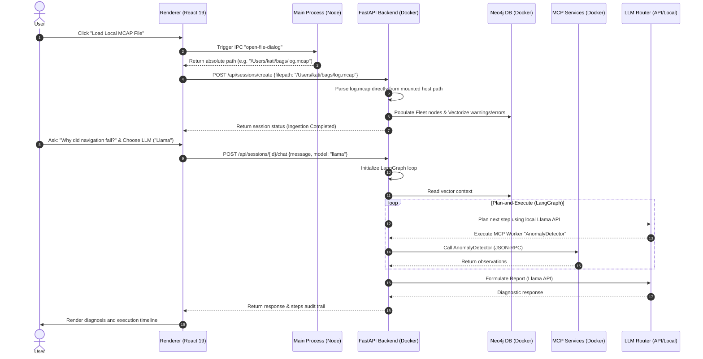

# Architecture Design - DataPilot

This document outlines the system architecture, component breakdown, data flow, database schemas, and API design for DataPilot.

---

## 1. High-Level System Architecture

DataPilot is structured as an **Electron-based desktop application** that runs entirely on the engineer's local machine. This ensures that massive binary robotics telemetry files (rosbags) do not need to be uploaded to cloud systems. 

The Electron application uses a hybrid architecture built as a **single unified Node package**:
- **Renderer Process**: Runs the React 19 user interface built with Vite (via `electron-vite`).
- **Main Process (Node.js)**: Runs in the OS environment, communicates with the **Docker socket** (`/var/run/docker.sock`) to orchestrate local backend microservices, and manages native OS functions (e.g., file pickers).
- **Preload Script**: Exposes a contextBridge API to the Renderer using typed contracts defined in a shared namespace.
- **Backend Stack (Local Docker Services)**: Spin up dynamically via the Docker socket when Electron starts. This stack includes the **FastAPI Backend (embedding LangGraph)**, a **Neo4j Graph Database** (Fleet Knowledge Graph), and **5 MCP Workers** running as separate containers.
- **LLM Connectivity**: The orchestrator coordinates with either cloud APIs (**OpenAI**, **Gemini**) or a locally hosted **Llama** model.



---

## 2. Component Breakdown

### A. Electron Client (Vite + React 19)
* **Renderer Process**:
  - Renders the primary workspace dashboards, log timeline charts, and the diagnostic chat terminal using React 19.
  - All chart visualizations (Timeline, Metric, Map, KGraph, MiniTimeline) are **bespoke React + SVG components** ported directly from the mock design workspace. This ensures exact visual design parity and prevents layout reflows without external charting library overhead.
  - Implements a dedicated **Setup & Troubleshooting Screen** that is displayed if the Docker socket check fails.
  - Screen switching is **rail-driven** via a global `screen` state managed in a `zustand` store (no URL router or hash routing).
  - Fonts are bundled locally and loaded via `@fontsource/inter` and `@fontsource/jetbrains-mono` npm packages.
* **Preload Script**:
  - Exposes `contextBridge.exposeInMainWorld('datapilot', ...)` using typed IPC channels and payload schemas imported from the shared codebase, eliminating raw `ipcRenderer` calls and ensuring type-safety.
* **Main Process (Node.js)**:
  - **Docker Socket Orchestrator**: Connects to the Unix socket `/var/run/docker.sock` via `dockerode`. On startup, it checks if Docker is active and pulls/launches the containerized stack (FastAPI, Neo4j, and the 5 MCP servers).
  - **IPC Bridge Handler**: Coordinates secure IPC events between the Renderer and Main process.
  - **Native File System Picker**: Opens native OS dialogs to select local `.mcap` files, bypassing browser file upload limits.

### B. Shared Module (`src/shared/`)
* Declares standard, immutable IPC channel contracts and request/response structures.
* Declares backend API response interfaces mirroring the FastAPI Pydantic schemas, ensuring type contracts across the backend and Electron processes cannot drift.

### C. Backend Container (FastAPI + LangGraph)
* **API Layer**: Exposes endpoints on local port `8000` to feed dashboard analytics and manage chat sessions.
* **LangGraph Orchestrator**: Runs the supervisor-specialist multi-agent state machine. It uses LangGraph's standard SQLite saver to persist state checkpoints locally.
* **LLM Router**: Dispatches reasoning queries based on user settings:
  - **OpenAI**: Connects to cloud API.
  - **Gemini**: Connects to cloud API.
  - **Llama**: Connects to a locally running model instance (e.g., Ollama running on port `11434`).

### D. MCP Workers (Docker Services)
Decoupled services running inside independent Docker containers on the local machine:
1. **RosbagReader**: Extracts topic schemas, diagnostic streams, and TF transformations from raw bags.
2. **TrajectoryAnalyzer**: Computes velocities and plots path deviations.
3. **PlannerFailureInspector**: Checks navigation path states and costmaps.
4. **AnomalyDetector**: Performs statistical evaluation on high-frequency channels.
5. **ReportComposer**: Formats tree characters and recommendations.

### E. Storage & Database Layer
* **Host Local Filesystem**: Stores original rosbags and the SQLite database (`db.sqlite`), allowing data persistence across container restarts.
* **Neo4j Container**: Runs inside the local Docker environment, hosting the Fleet Knowledge Graph and storing log embeddings locally.

---

## 3. Data Flow Diagram

### Phase 1: Startup & Docker Verification Flow


### Phase 2: Ingestion & Chat Analysis Flow


---

## 4. Technology Stack Recommendation

| Layer | Recommended Choice | Justification |
| :--- | :--- | :--- |
| **Desktop Shell** | **Electron** | Cross-platform desktop runtime packaging Chromium and Node.js. |
| **Build System** | **electron-vite** | Unified tooling config that compiles the main process, preload scripts, and renderer with Hot Module Replacement (HMR). |
| **Renderer Framework**| **React 19** | Modern UI framework for rendering dynamic states, without Next.js/SSR overhead. |
| **Styling** | **Vanilla CSS** | Porting the custom mock design theme verbatim into Tailwind v4 `@theme` tokens. |
| **Fonts** | **@fontsource/inter** & **@fontsource/jetbrains-mono** | Local npm font packages bundled by Vite, avoiding Google Fonts network calls. |
| **Docker Orchestration** | **dockerode** (Node.js SDK) | Node.js library that accesses `/var/run/docker.sock` to manage containers. |
| **Backend Framework** | **FastAPI** (within Docker) | Exposes endpoints to Electron, running containerized to maintain Python version consistency. |
| **Orchestrator** | **LangGraph** (Python) | Embedded in backend container, manages multi-step agent logic. |
| **Database** | **SQLite + Neo4j** | SQLite on host handles sessions and checkpointers. Neo4j in Docker stores graphs and vectors. |
| **Charts** | **Bespoke React + SVG Components** | Custom SVG graphics for timeline, metrics, and KGraph views, matching the mock design with zero external dependencies. |
| **LLM APIs** | **OpenAI, Gemini, Llama** | Routes queries to either cloud API gateways or local ports (e.g. Ollama for local Llama). |

---

## 5. Database Schema Draft

### SQLite Schema
Used for session metadata, settings configs, cost tracking, and LangGraph state checkpointers.

```sql
-- Represents a single loaded rosbag debugging session
CREATE TABLE sessions (
    id TEXT PRIMARY KEY, -- UUID
    filename TEXT NOT NULL,
    filepath TEXT NOT NULL, -- Absolute path on the host filesystem
    robot_name TEXT,
    ros_version TEXT,
    duration_seconds REAL,
    start_time TEXT,
    end_time TEXT,
    total_messages INTEGER,
    topics_list TEXT,
    created_at TIMESTAMP DEFAULT CURRENT_TIMESTAMP
);

-- Maintains conversational thread history per session
CREATE TABLE chat_messages (
    id INTEGER PRIMARY KEY AUTOINCREMENT,
    session_id TEXT NOT NULL,
    role TEXT NOT NULL, -- 'user' or 'assistant'
    content TEXT NOT NULL,
    execution_steps TEXT, -- JSON array of tools executed in this turn
    citations TEXT, -- JSON array of source log links
    created_at TIMESTAMP DEFAULT CURRENT_TIMESTAMP,
    FOREIGN KEY (session_id) REFERENCES sessions(id) ON DELETE CASCADE
);

-- Specialist model selection overrides (mutable via Agents UI)
CREATE TABLE agent_models (
    specialist TEXT PRIMARY KEY,
    model_id TEXT NOT NULL
);

-- Token usage and cost tracking telemetry per chat turn
CREATE TABLE session_costs (
    id INTEGER PRIMARY KEY AUTOINCREMENT,
    session_id TEXT NOT NULL,
    turn_index INTEGER NOT NULL,
    tokens_in INTEGER NOT NULL,
    tokens_out INTEGER NOT NULL,
    est_cost_usd REAL NOT NULL,
    created_at TIMESTAMP DEFAULT CURRENT_TIMESTAMP,
    FOREIGN KEY (session_id) REFERENCES sessions(id) ON DELETE CASCADE
);

-- LangGraph State Checkpointer table (handled automatically by SqliteSaver)
-- Table: langgraph_checkpoints (survives Electron app restarts)
```

### Neo4j Fleet Graph Schema
Models fleet metadata, runs, occurrences, and root causes.

#### Nodes
- **Robot** (`id`, `model`, `fleet`, `metadata`)
- **Component** (`name`, `type` [sensor/planner/controller/actuator], `serial`)
- **Run** (`bag_id`, `start_time`, `end_time`, `environment_tags`, `log_embedding` [vector])
- **Incident** (`timestamp`, `description`, `severity`, `anomaly_score`)
- **FailureMode** (`name`, `description`, `typical_root_cause`, `resolution_steps`)
- **EnvironmentCondition** (`rain`, `lighting`, `temperature`, `payload`)

#### Relationships
- `(Robot)-[:HAS_COMPONENT]->(Component)`
- `(Incident)-[:DURING_RUN]->(Run)`
- `(Incident)-[:CAUSED_BY]->(FailureMode)`
- `(Incident)-[:OCCURRED_IN]->(EnvironmentCondition)`
- `(Incident)-[:RESOLVED_BY]->(FailureMode)`
- `(Run)-[:SIMILAR_TO]->(Run)` (Semantic link based on log_embedding cosine similarity)

---

## 6. API Endpoint Design

All endpoints are hosted on `http://localhost:8000/api`.

### Session Creation

#### 1. Ingest Local File
* **Method**: `POST`
* **Path**: `/api/sessions/create`
* **Request**:
  ```json
  {
    "filepath": "/Users/kati/bags/nav_crash_sample.mcap"
  }
  ```
* **Response**: `202 Accepted`
  ```json
  {
    "session_id": "8f8981df-83cd-41e9-86f2-1fb49cb45e99",
    "filepath": "/Users/kati/bags/nav_crash_sample.mcap",
    "status": "processing"
  }
  ```

### Chat Debugging with LLM Selection

#### 2. Chat & Diagnose
* **Method**: `POST`
* **Path**: `/api/sessions/{session_id}/chat`
* **Request**:
  ```json
  {
    "message": "Why did the navigation abort?",
    "composer_provider": "llama", -- "openai" | "gemini" | "llama"
    "composer_model": "llama-3.3-8b"
  }
  ```
* **Response**: `200 OK` (Streams SSE payload containing plan steps status, token streams, and final structured citations/audit_trail blocks).
