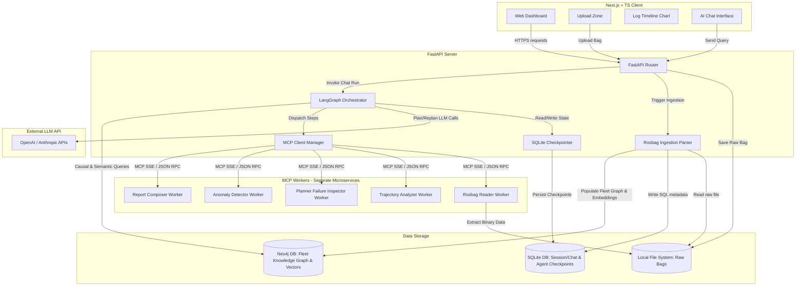
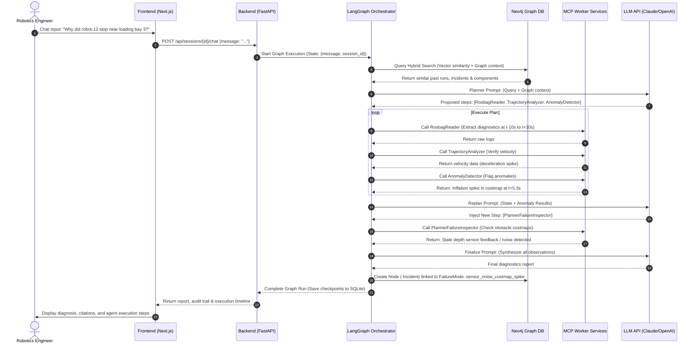

# Architecture Design - DataPilot

This document outlines the system architecture, component breakdown, data flow, database schemas, and API design for DataPilot.

---

## 1. High-Level System Architecture

DataPilot is structured as an AI-native full-stack application built for robotics diagnostic operations. It embeds a **LangGraph Orchestrator** inside a **FastAPI backend** to manage stateful, multi-step diagnostics. The backend dispatches tasks to decoupled, domain-specific **MCP Workers** running as separate microservices. The data layer is hybrid, combining **SQLite** (for web app session metadata, chat histories, and agent checkpointing) with a **Neo4j Property Graph** (for fleet causal indexing and native vector search).



---

## 2. Component Breakdown

### A. Frontend (Next.js + TypeScript)
* **Ingestion Dashboard**: Manages drag-and-drop file uploads, progress bars, and state management for active debugging sessions.
* **Timeline Visualizer**: Renders an interactive, zoomable timeline chart of warnings, errors, and critical messages from the bag, allowing developers to isolate the time window of a crash.
* **RAG Chat Window**: A conversational terminal-style UI allowing developers to talk to the AI engine, rendering markdown, audit trails (agent steps), citations, and charts.
* **Status Monitor**: Displays robot metadata extracted from the bag (e.g., node list, total topics, and diagnostics).

### B. Backend (FastAPI + LangGraph)
* **API Layer**: Handles routing for file uploads, sessions listing, chat interactions, and telemetry logs retrieval.
* **Rosbag Ingestion Parser**: Custom pipeline that opens ROS 2 `.mcap` or `.db3` bags using Python readers, extracts text records, filters for critical logs (severity > INFO), writes SQLite metadata, and seeds the Neo4j Fleet Graph.
* **LangGraph Orchestrator**: The core supervisor agent. It coordinates the **Plan-and-Execute loop**:
  1. *Planner*: Uses LLMs to decompose a user query into a sequence of worker calls.
  2. *Executor*: Resolves and triggers worker tools sequentially through the MCP client.
  3. *Replan*: Inspects outputs and dynamically injects new diagnostic steps (e.g., if an anomaly is flagged).
  4. *Finalize*: Synthesizes final results.
  It uses LangGraph's standard SQLite saver to checkpoint graph states, enabling full auditability.
* **MCP Client Manager**: Establishes connections with independent Model Context Protocol (MCP) server endpoints via Server-Sent Events (SSE). It handles tool discovery, parameters schema validation, and request/response streaming.

### C. MCP Workers (Separate Microservices)
Each worker is deployed as an independent microservice exposing its capability over an MCP interface:
1. **RosbagReader**: Opens a bag, extracts topic streams, diagnostics, and transform tree (TF) parameters within a requested time window.
2. **TrajectoryAnalyzer**: Computes velocity profiles, goal distances, path deviations, and checks for motor constraints.
3. **PlannerFailureInspector**: Examines navigation planner server state transitions, costmap inflation data, and recovery attempts.
4. **AnomalyDetector**: Performs statistical anomaly detection on high-frequency numeric streams (velocity command, CPU utilization, battery voltage).
5. **ReportComposer**: Combines diagnostic details into a structured, natural-language explanation and builds timeline charts.

### D. Storage & Database Layer
* **Raw Filesystem**: Stores uploaded rosbags locally on disk.
* **SQLite (SQL DB)**: Stores Next.js session records, chat messages, and LangGraph's agent state checkpoints.
* **Neo4j (Knowledge Graph DB)**: Acts as the Fleet Knowledge Graph. It models multi-hop causal relationships (Robot → Component → Run → Incident → FailureMode) and supports hybrid queries using Neo4j's native vector index for log embeddings.

---

## 3. Data Flow Diagram

The diagram below details the multi-agent orchestration flow when a user asks a root-cause question:



---

## 4. Technology Stack Recommendation

| Layer | Recommended Choice | Justification |
| :--- | :--- | :--- |
| **Frontend Framework** | Next.js (App Router) | Production-ready with Server-Side Rendering (SSR), React Server Components (RSC), and built-in routing. |
| **Styling** | Vanilla CSS | Provides complete customizability to design a stunning, responsive, dark-mode terminal layout. |
| **State & Fetching** | Axios + TanStack Query | Ideal for managing server state, polling parse progress, and caching chat sessions. |
| **Charts** | Recharts / Chart.js | Easy to build interactive timeline charts with click handlers. |
| **Backend Language** | Python 3.10+ | Necessary for importing ROS bag reader libraries, LangGraph, and MCP client/server SDKs. |
| **Backend Framework** | FastAPI | Async requests, automatic Swagger docs, Pydantic type safety, and fast response latency. |
| **Orchestrator** | LangGraph (Python) | Explicit state management, built-in checkpointing, model-agnosticism, and native plan-and-execute support. |
| **Worker Interface** | Model Context Protocol (MCP) | Open standard that decouples workers, supports schema discovery, and is language-neutral. |
| **Relational Database**| SQLite | Lightweight SQL database, perfect for local Next.js session storage and LangGraph checkpoints. |
| **Knowledge Graph** | Neo4j (v5.x) | Handles multi-hop causal chains, runs graph data science algorithms, and includes native vector indexing. |
| **ROS Bag Parser** | `mcap` & `mcap-ros2-support` | Read modern MCAP files directly in Python without requiring a local ROS installation. |
| **AI LLM API** | Anthropic Claude 3.5 Sonnet | Best-in-class reasoning for complex system debugging and large code/log contexts. |

---

## 5. Database Schema Draft

### SQLite Schema
Used for session management, chat histories, and LangGraph checkpoints.

```sql
-- Represents a single uploaded rosbag debugging session
CREATE TABLE sessions (
    id TEXT PRIMARY KEY, -- UUID
    filename TEXT NOT NULL,
    filepath TEXT NOT NULL,
    robot_name TEXT,
    ros_version TEXT, -- "ROS1" or "ROS2"
    duration_seconds REAL,
    start_time TEXT, -- ISO Timestamp
    end_time TEXT, -- ISO Timestamp
    total_messages INTEGER,
    topics_list TEXT, -- JSON array of strings
    created_at TIMESTAMP DEFAULT CURRENT_TIMESTAMP
);

-- Maintains conversational thread history per session
CREATE TABLE chat_messages (
    id INTEGER PRIMARY KEY AUTOINCREMENT,
    session_id TEXT NOT NULL,
    role TEXT NOT NULL, -- 'user' or 'assistant'
    content TEXT NOT NULL,
    execution_steps TEXT, -- JSON array of tools executed in this turn
    citations TEXT, -- JSON array of source log links
    created_at TIMESTAMP DEFAULT CURRENT_TIMESTAMP,
    FOREIGN KEY (session_id) REFERENCES sessions(id) ON DELETE CASCADE
);

-- LangGraph State Checkpointer table (handled automatically by SqliteSaver)
-- Stores binary state records, thread IDs, and checkpoint details.
```

### Neo4j Fleet Graph Schema
Models fleet metadata, runs, occurrences, and root causes.

#### Nodes
- **Robot** (`id`, `model`, `fleet`, `metadata`)
- **Component** (`name`, `type` [sensor/planner/controller/actuator], `serial`)
- **Run** (`bag_id`, `start_time`, `end_time`, `environment_tags`, `log_embedding` [vector])
- **Incident** (`timestamp`, `description`, `severity`, `anomaly_score`)
- **FailureMode** (`name`, `description`, `typical_root_cause`, `resolution_steps`)
- **EnvironmentCondition** (`rain`, `lighting`, `temperature`, `payload`)

#### Relationships
- `(Robot)-[:HAS_COMPONENT]->(Component)`
- `(Incident)-[:DURING_RUN]->(Run)`
- `(Incident)-[:CAUSED_BY]->(FailureMode)`
- `(Incident)-[:OCCURRED_IN]->(EnvironmentCondition)`
- `(Incident)-[:RESOLVED_BY]->(FailureMode)`
- `(Run)-[:SIMILAR_TO]->(Run)` (Semantic link based on log_embedding cosine similarity)

---

## 6. API Endpoint Design

All API endpoints are prefixed with `/api`.

### Ingestion endpoints

#### 1. Upload Rosbag
* **Method**: `POST`
* **Path**: `/api/upload`
* **Request**: Multi-part Form Data
  * `file`: Binary file (.mcap or .db3)
* **Response**: `202 Accepted`
  ```json
  {
    "session_id": "8f8981df-83cd-41e9-86f2-1fb49cb45e99",
    "filename": "nav_crash_sample.mcap",
    "status": "processing"
  }
  ```

#### 2. Get Parsing Status
* **Method**: `GET`
* **Path**: `/api/sessions/{session_id}/status`
* **Response**: `200 OK`
  ```json
  {
    "session_id": "8f8981df-83cd-41e9-86f2-1fb49cb45e99",
    "status": "completed", -- "processing", "failed", "completed"
    "progress": 100,
    "error_message": null
  }
  ```

### Session Analysis endpoints

#### 3. Get Session Metadata
* **Method**: `GET`
* **Path**: `/api/sessions/{session_id}`
* **Response**: `200 OK`
  ```json
  {
    "session_id": "8f8981df-83cd-41e9-86f2-1fb49cb45e99",
    "metadata": {
      "filename": "nav_crash_sample.mcap",
      "robot_name": "turtlebot4_03",
      "duration_seconds": 124.5,
      "topics": ["/rosout", "/diagnostics", "/cmd_vel", "/scan"],
      "start_time": "2026-05-24T14:02:10Z"
    }
  }
  ```

#### 4. Get Log Timeline Data
* **Method**: `GET`
* **Path**: `/api/sessions/{session_id}/timeline`
* **Response**: `200 OK`
  ```json
  {
    "timeline": [
      {
        "timestamp_offset": 12.4,
        "level": "WARN",
        "node": "/lidar_driver_node",
        "message": "Lidar packet timeout, retrying connection."
      },
      {
        "timestamp_offset": 14.8,
        "level": "ERROR",
        "node": "/lidar_driver_node",
        "message": "Lidar hardware communication lost."
      }
    ]
  }
  ```

### Chat Debugging endpoints

#### 5. Chat & Diagnose
* **Method**: `POST`
* **Path**: `/api/sessions/{session_id}/chat`
* **Request**:
  ```json
  {
    "message": "Why did the navigation abort at timestamp 14.8?"
  }
  ```
* **Response**: `200 OK`
  ```json
  {
    "response": "The navigation aborted because the `/lidar_driver_node` crashed due to a hardware communication loss. This caused the dynamic obstacles costmap to receive stale data, triggering a safety abort in the `/controller_server` node.",
    "audit_trail": {
      "plan": ["RosbagReader", "TrajectoryAnalyzer", "AnomalyDetector", "PlannerFailureInspector"],
      "execution_steps": [
        {
          "step": 1,
          "worker": "RosbagReader",
          "input": {"time_window": [4.8, 24.8], "topics": ["/rosout"]},
          "status": "success"
        },
        {
          "step": 2,
          "worker": "TrajectoryAnalyzer",
          "input": {"time_window": [4.8, 24.8]},
          "status": "success"
        },
        {
          "step": 3,
          "worker": "AnomalyDetector",
          "input": {"time_window": [4.8, 24.8]},
          "status": "success",
          "observation": "Costmap inflation spike at t+5.3s"
        },
        {
          "step": 4,
          "worker": "PlannerFailureInspector",
          "input": {"time_window": [4.8, 24.8]},
          "status": "success"
        }
      ],
      "replanned": true,
      "replanned_steps": ["PlannerFailureInspector"]
    },
    "citations": [
      {
        "timestamp_offset": 14.8,
        "node": "/lidar_driver_node",
        "log_level": "ERROR",
        "message": "Lidar hardware communication lost."
      }
    ]
  }
  ```

---

## 7. Deployment Architecture

For the 1-week hackathon, DataPilot is packaged using a multi-container **Docker Compose** layout:

* **Frontend Container**: Serves the Next.js application on port `3000`.
* **Backend Container**: Runs the FastAPI web app on port `8000`. It acts as the LangGraph Orchestrator client and connects to the database services and MCP server endpoints.
* **Neo4j Container**: Runs Neo4j Community Edition (port `7474` for browser GUI, `7687` for Bolt protocol), with vector indexing activated. A startup script seeds the database with initial model nodes.
* **MCP Worker Containers**: Five independent lightweight Python services running on dedicated local ports, exposing their specific MCP JSON-RPC APIs over Server-Sent Events (SSE).
* **SQLite Database File**: Bind-mounted in `./data/db.sqlite` to persist state across backend restarts.
